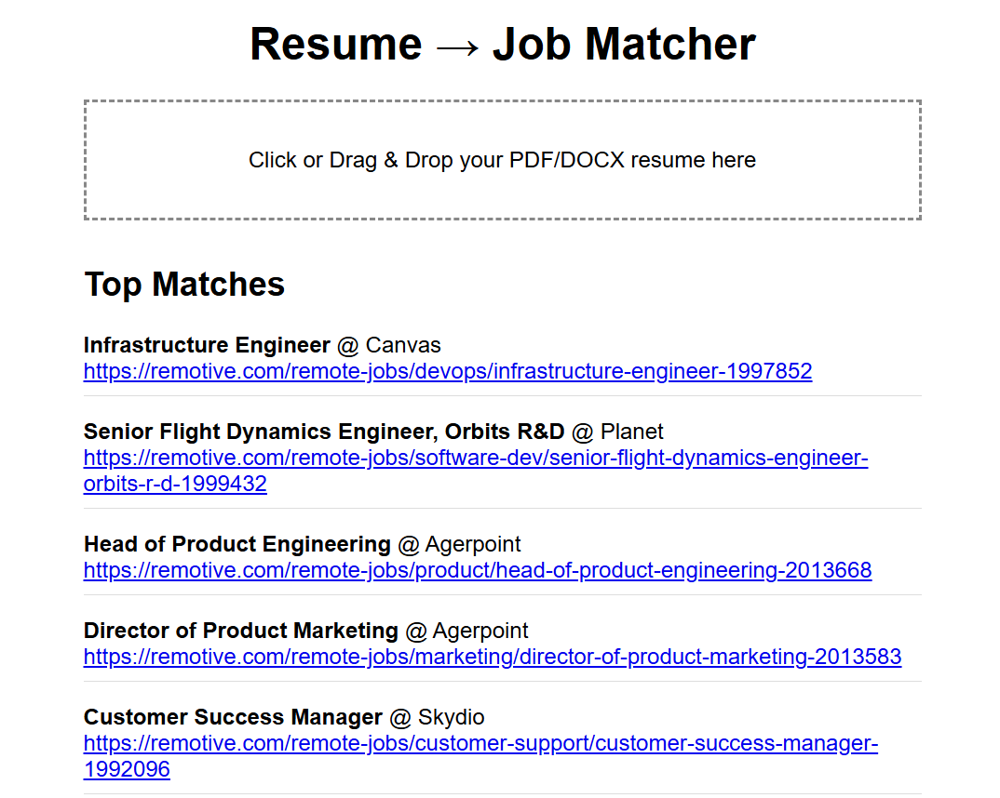

# 🔍 Resume → Job Matcher: Smarter AI-Powered Job Discovery  



Tired of job boards that miss the mark?  
**This AI-driven tool goes beyond keyword matching**—it *understands* your resume and finds jobs that truly fit your skills, even if the language doesn’t match perfectly. Fast. Smart. Personal.

---

##  What It Does

**Semantic Resume Matching**  
Find jobs that *actually make sense* for your experience by leveraging state-of-the-art NLP.  

**Blazing Fast Results**  
From resume to top 5 tailored job matches—**in under five seconds**.

**Context-Aware Search**  
No more "missed matches" due to phrasing differences. This system uses **MiniLM sentence transformers** to interpret your resume like a human recruiter would.

**Skill Augmentation**  
Automatically detects related tools and technologies to expand your job match horizon—finding roles you qualify for even if you didn’t list every single skill.

**One-Click Apply Links**  
Get key info: job title, company, and direct apply links. Skip the clutter.

---

## Tech Stack

| Layer       | Tech Used |
|-------------|-----------|
| **Backend** | FastAPI (Python) |
| **NLP**     | SentenceTransformers, spaCy, PDFMiner |
| **Search**  | FAISS vector similarity |
| **Frontend**| Vanilla HTML/CSS/JavaScript |
| **Jobs API**| Remotive.io |

---

##  Getting Started

###  Prerequisites

- Python 3.8+
- `pip`

###  Setup

```bash
# Clone the repository
git clone https://github.com/yourusername/resume_job_matcher.git
cd resume_job_matcher

# Set up virtual environment
python -m venv venv

# Activate the environment
# On Windows:
venv\Scripts\activate
# On macOS/Linux:
source venv/bin/activate

# Install dependencies
pip install -r requirements.txt

# Download spaCy NLP model
python -m spacy download en_core_web_sm
